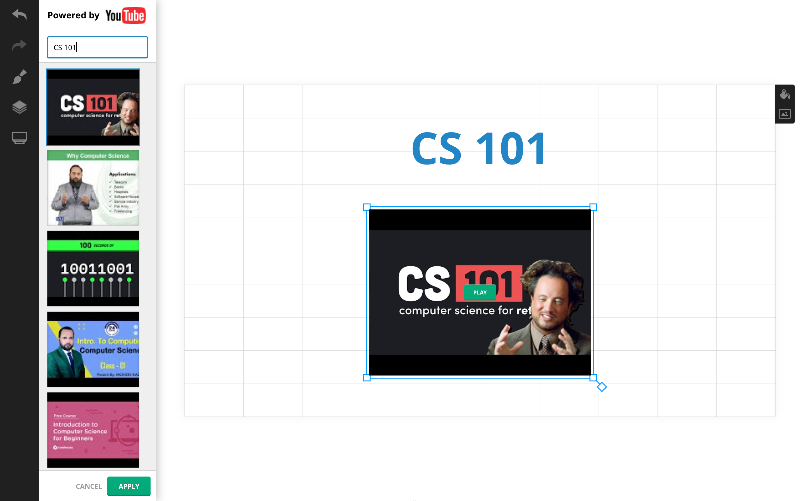

# RedactorGN: online presentation tool

## **[Online demo](https://dmitry-vsl.github.io/redactor_gn)**

## Credits

Programming: [Dmitry Vasilev](https://github.com/dmitry-vsl), [Irina Kozyarskaya](https://www.linkedin.com/in/%D0%B8%D1%80%D0%B8%D0%BD%D0%B0-%D0%BA%D0%BE%D0%B7%D1%8F%D1%80%D1%81%D0%BA%D0%B0%D1%8F-06121494/)

UX: [Oleg Geranin](https://www.linkedin.com/in/oleg-geranin-2283049a/), [Boris Strelchik](https://www.linkedin.com/in/strelchik/)

## Screenshots

&nbsp;

&nbsp;

&nbsp;

&nbsp;

